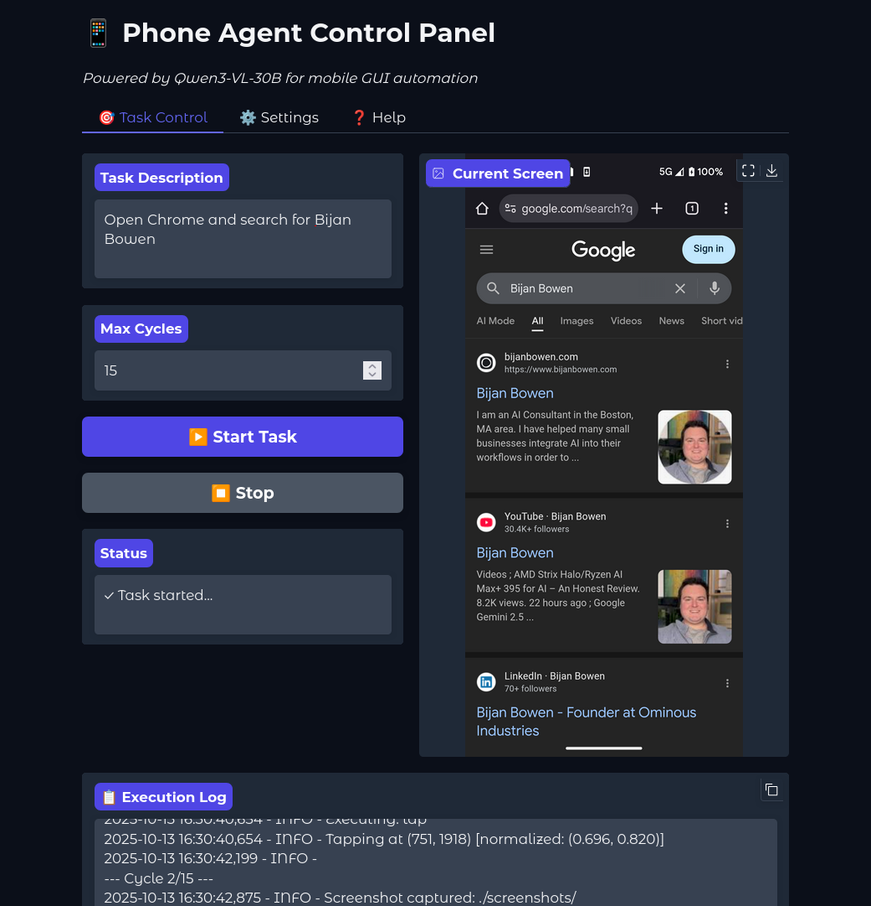

# Phone Driver

An AI-powered Claude Code skill that automates Android devices. Describe a task in natural language and Claude will execute it — learning from each interaction to replay tasks instantly next time.

<p align="center">
  
</p>

## Features

- **Zero dependencies** — No Python ML libraries, no GPU, no model downloads. Just ADB + Claude Code.
- **Skill learning** — First time discovering, every time after instant replay
- **Tree-structured memory** — Learns app screens, element locations, and task recipes
- **Multi-device support** — Same skills work across devices, coordinates adapt per device
- **Natural language** — Describe what you want, Claude figures out how
- **Safety built-in** — Refuses destructive actions unless explicitly requested

## Install

### One-line installer (recommended)

```bash
curl -sL https://raw.githubusercontent.com/mohitsoni48/phone-driver/main/install.sh | bash
```

### From source

```bash
git clone https://github.com/mohitsoni48/phone-driver.git
cd PhoneDriver
./install.sh
```

### What gets installed

```
~/.claude/commands/phone-driver.md     ← The skill (Claude Code command)
~/.claude/phonedriver/
├── scripts/adb-helpers.sh             ← ADB helpers + batch actions
├── scripts/memory-tree.py             ← Skill tree operations
└── memory.json                        ← Learned skills (persists across updates)
```

## Prerequisites

- [Claude Code](https://claude.ai/code) CLI
- ADB (Android Debug Bridge) on PATH
- Android device with USB debugging enabled
- Python 3 (for memory operations)

### Install ADB

**macOS:**
```bash
brew install android-platform-tools
```

**Linux:**
```bash
sudo apt install adb
```

### Connect your device

1. Enable USB debugging: **Settings → Developer Options → USB Debugging**
2. Connect via USB
3. Verify: `adb devices` (should show your device as `device`)

## Usage

In Claude Code:

```
/phone-driver "open Chrome and search for weather"
/phone-driver "open Settings and enable WiFi"
/phone-driver "open Calculator and compute 123 + 456"
/phone-driver "open YouTube"
```

### How it works

**First time** (Learn Mode):
1. Launches app via intent (instant)
2. Discovers screens and elements via UI dump
3. Executes actions (tap, type, swipe)
4. Saves everything to the skill tree
5. Compiles task recipe for instant replay

**Second time** (Replay Mode):
1. Reads skill library → finds matching task
2. Executes entire sequence in ONE batch call
3. No UI dumps, no screenshots, no trial and error

**Partial match**:
If you ask "search for weather in Chrome and click first result" and it only knows "search for weather in Chrome", it replays the known prefix and only discovers the new "click first result" part.

## How the skill tree works

PhoneDriver builds a tree of everything it learns:

```
Apps
├── chrome (package, intent, aliases)
│   └── Screens
│       ├── home → elements: [search_bar, menu_button]
│       ├── search_input → elements: [url_bar_focused]
│       └── search_results → elements: [first_result]
│
Tasks (replayable recipes)
├── search_in_chrome: "search for {query} in chrome"
│   steps: launch → tap search_bar → type {query} → press ENTER
│   compiled: "launch chrome; waitfor search_box 10; tap 540 188; ..."
│
Settings Shortcuts
├── wifi → android.settings.WIFI_SETTINGS
├── bluetooth → android.settings.BLUETOOTH_SETTINGS
└── ...
```

- **Element locations** are stored per-device (same skill works on any phone)
- **Tasks** are parameterized (e.g., `{query}` → reusable with any search term)
- **Memory persists** across updates (install won't overwrite learned skills)

## Uninstall

```bash
rm ~/.claude/commands/phone-driver.md
rm -rf ~/.claude/phonedriver
```

## License

Apache License 2.0 — see [LICENSE](LICENSE) file for details.

## Acknowledgments

- Powered by [Claude Code](https://claude.ai/code) by Anthropic
- Uses [ADB](https://developer.android.com/tools/adb) for device communication
- Original vision model concept inspired by [Qwen3-VL](https://github.com/QwenLM/Qwen-VL)
